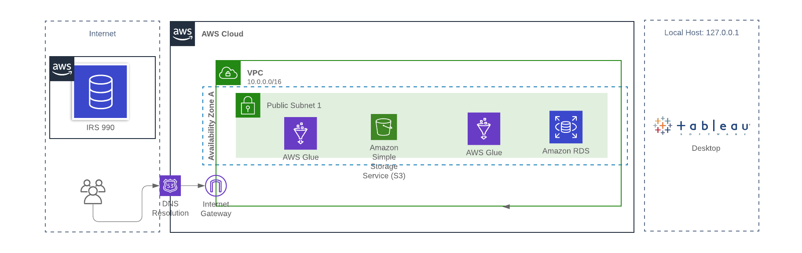
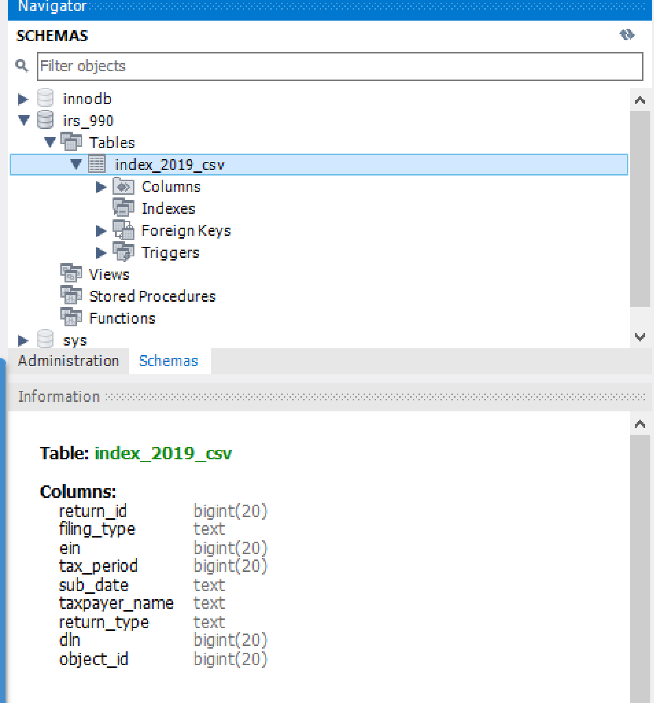
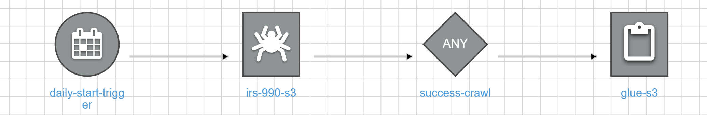
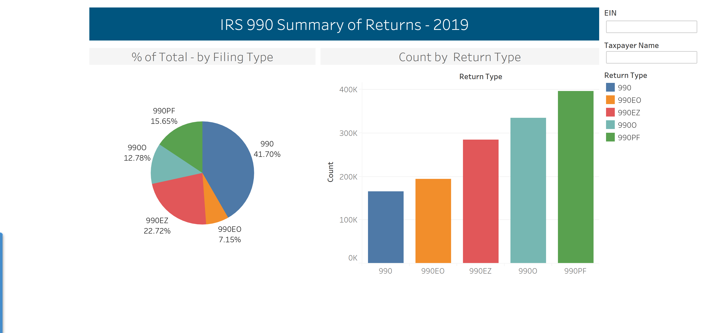

# Lab 4: Creating an end-to-end Pipeline

| **Assignment** | Lab #4 |
| --- | --- |
| **Points:** | 200 |


## 0.0 Description

For this assignment, you will be connecting to an external data source, loading it into a MySQL instance and then visualizing the data through your Tableau desktop version. The data set we will use is the 2019 IRS submissions from the IRS 990 database.

Here are the steps to follow:

- Set-up the infrastructure and create the database
- Load the data in S3 and test the Glue Crawler
- Create the connections and AWS ETL job using Glue
- Create the visualization

The background of this dataset can be found in the following documentation:

- [https://docs.opendata.aws/irs-990/readme.html](https://docs.opendata.aws/irs-990/readme.html)
- [https://aws.amazon.com/opendata/public-datasets/](https://aws.amazon.com/opendata/public-datasets/)

The goal is to generate a CSV file from public data source (IRS 990) data and load it into a data store that you created (S3 bucket) which will then be propagated to a MySQL database for connection to Tableau. The use case represents many of the common themes learned in class.

**This is an easy assignment if you follow the instructions carefully. Be sure to read the instructions and follow the videos.**

## 1.0 Set up the Infrastructure and Create the Database

The following depicts the framework we will create for this solution:



You will need to follow these instructions to create your environment:

  * 1.1 First, create a database (I called mine &#39;database-3&#39;) in Amazon RDS using the standard configuration we have typically used for this class.
  * 1.2 Once created, test the connection using your database credentials and connection string from MySQL workbench.[^1]
  

## 2.0 Load the data in S3 bucket

Now that you have set up the database connection, you will create an S3 bucket called &#39;irs-990&#39;. This is where you will run your script to update the S3 bucket.

  * 2.1 Log into your AWS Console and create an S3 bucket called **irs-990**
  * 2.2 Configure the bucket so that it is publicly accessible.
  * 2.3 For more information on how to create an S3 bucket, refer to the materials in class or follow this documentation [here](https://docs.aws.amazon.com/AmazonS3/latest/gsg/CreatingABucket.html).

## 3.0 Create the connections and AWS ETL job using Glue

Now that you have created your S3 bucket, you will set up an AWS Glue Crawler and connect it to the AWS database you created in MySQL. This Crawler runs a check on the S3 bucket that you created and extracts and loads the file from IRS into your MySQL instance.

Please used the videos enclosed to assist you with completing this part of the assignment.

  * 3.1 Create a Database Connection from AWS Glue to RDS MySQL
    * 3.1.1 Note: you will need to create a Glue Role with the following privileges
    * 3.1.2 Navigate to Connections'' and follow the instructions to creating a Connection' directly to your AWS MySQL instance.

| List of Policies |
| --- |
| AmazonRDSFullAccess |
| AmazonRDSDirectoryServiceAccess |
| AWSGlueServiceRole |
| AWSGlueServiceNotebookRole |
| AdministratorAccess |
| AmazonRDSDataFullAccess |
| AWSGlueConsoleFullAccess |
| AWSGlueConsoleSageMakerNotebookFullAccess |
| AmazonS3FullAccess |

  * 3.2 Create a Data Store called &#39;irs-990&#39; and link it to your database using the jdbc connection string:
  ```jdbc:mysql://database-3.cbzjgd29kkbg.us-east-1.rds.amazonaws.com:3306/irs\_990 ```
  * 3.3 Create a Classifier to specify the structure of the file set being created
  * 3.4 Create the Crawler under AWS Glue left-hand menu items. The Crawler you will create will crawl the public IRS 990 s3 bucket with the following path:
         ``` s3://irs-form-990/index\_2019.csv``` 
  * 3.5 Once you have created the Crawler, run the Crawler to the specified location in your S3 bucket (&#39;irs-990&#39;). The Crawler pulls the file into your S3 location. <i> Note: this may take several minutes to execute.</i>
  * 3.6 Once you have crawled the irs-form-990 database, check to see that the database and table was successfully created by navigating to &#39;Tables&#39; under the Glue service screen.
  * 3.7  Once confirmed, now you can create a &#39;Job&#39; to move the data from this location (your S3 bucket), to the MySQL database. You can use the Spark/Python Shell to autogenerate the script using the Glue interface.
  * 3.8 Once you have created the Job, run it and check that the database was properly updated with the table. Your result should look like this:



  * 3.9 . Create a Workflow to Run the Crawler and then update your MySQL database given a time schedule trigger at 11 PM. The workflow would look like this.



## 4.0 Create Connection and Visualization

Use the database file to create a schema in your own AWS RDS MySQL instance and connect to your Tableau Desktop instance. We will connect to the IRS 990 database you created in your AWS Database Instances.

### 4.1 Connect Tableau Desktop to AWS RDS

To create a connection to your AWS RDS MySQL instance, you will follow a very similar process to connecting the MySQL Workbench. Please follow these steps:

- **Step 1.** Navigate to creating a new connection
- **Step 2.** Select &#39;To a Server&#39;
- **Step 3.** Search for MySQL
- **Step 4.** When you click MySQL, you will be prompted for the connection properties
- **Step 5.** Use the connection string information for the instance you have created and enter the appropriate information:
  - Enter the MySQL RDS endpoint as your Server Host
  - Use the appropriate port for your RDS instance (e.g., 3306)
  - Enter the database schema to connect to. We will connect to **irs\_990**
  - Enter your username and password
- **Step 7.** Click &#39;Update Now&#39; and you should see your data appear
- **Note:** for this Assignment, you do not need to create any joins with fact or dimension tables. This only uses one table as the reference.

You can follow the videos on Canvas should you have trouble connecting. Remember you will need to make sure your IP address is added to the security group in order to access the MySQL RDS instance.

### 4.2 Creating visualizations

For this part of the Assignment, create the graphic described below and publish your Dashboard to Tableau Public. Your submission should be a link to the Public Dashboard and a Screenshot. Your result should look like the following:



Once you have completed this portion of the Assignment send the screenshot and the link to [brandon.chiazza@yu.edu](mailto:brandon.chiazza@yu.edu). Your screenshot file name should look like: LastName_FirstName_Lab_04_Submission.

[1](#sdfootnote1anc) For the RDS MySQL configuration, only MySQL v5 is compatible with [AWS Glue.](https://forums.aws.amazon.com/thread.jspa?threadID=306814)

